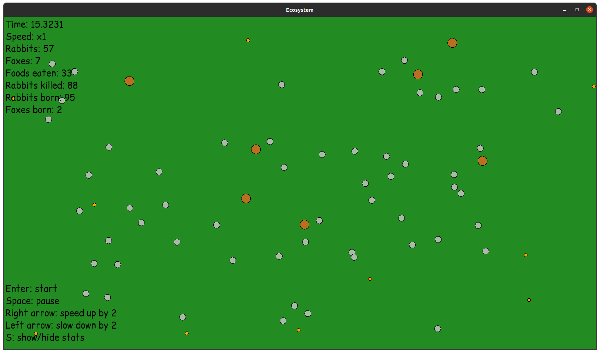
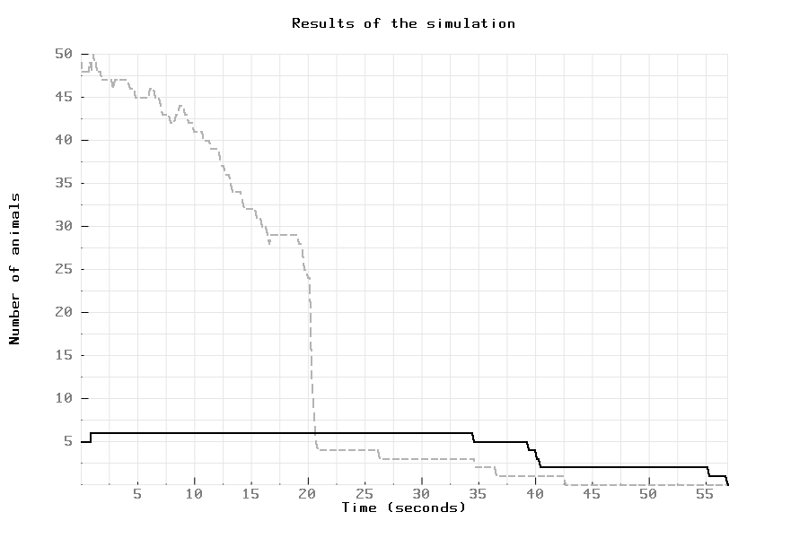
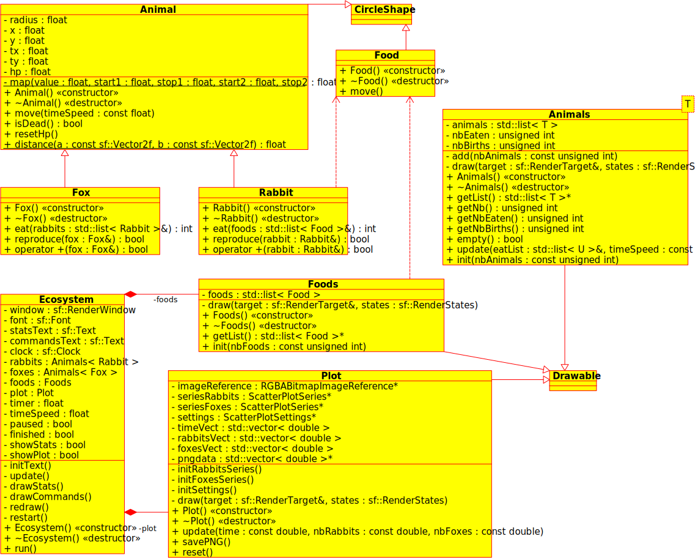

# Simulation d'un écosystème en C++

Ce projet est une simulation en C++ d'un écosystème basique, où des lapins et des renards évoluent.



## Installation

Ce projet utilise la librarie graphique SFML.
Pour installer SFML sur Linux :
```bash
sudo apt-get install libsfml-dev
```
Pour les autres OS, voir la documentation [ici](https://www.sfml-dev.org/tutorials/2.5/#getting-started).

Pour créer l'exécutable, il suffit d'entrer la commande `make`.

## Lancement

Il suffit de lancer l'exécutable `ecosystem.out` créé par la commande `make` :
```bash
./ecosystem.out
```

La fenêtre du simulateur doit apparaître. Pour lancer la simulation, pressez la touche `Enter`.

## Commandes

Voici les commandes de l'application :

- `Enter` : démarrer la simulation
- `Space` : mettre la simulation sur pause
- `Right arrow` : accélérer la simulation par 2
- `Left arrow` : ralentir la simulation par 2
- `S` : afficher/masquer les statistiques

## Fonctionnement

- Les animaux sont représentés par des cercles. Les lapins correspondent aux cercles gris et les renards aux cercles oranges. Au début de la simulation, les animaux sont placés aléatoirement sur la fenêtre. Ils débutent avec `1000` points de vie.

- De plus, une certaine quantité de nourriture est répartie sur la fenêtre. La nourriture est aussi représentée par un cercle.

- À chaque régénération de la fenêtre (voir *framerate*), les animaux se déplacent pseudo-aléatoirement en utilisant le bruit de Perlin (*Perlin noise*). Leurs points de vie diminuent d'un point par déplacement.

- Deux entités interagissent entre elles lorsque les cercles qui les représentent se superposent. Voici les interactions entre les entités :

    * **Quand un lapin rencontre de la nourriture**, le lapin mange la nourriture. La nourriture est régénérée à un autre endroit de la fenêtre et le lapin régénère ses points de vie à la valeur de départ.
    * **Quand un renard rencontre un lapin**, le renard mange le lapin. Le renard régénère ses points de vie, et le lapin disparaît.
    * **Quand un lapin rencontre un autre lapin**, un nouveau lapin naît avec une certaine probabilité (définie à `0.3`).
    * **Quand un renard rencontre un autre renard**, un nouveau renard naît avec une certaine probabilité (définie à `0.3`).
    * **Quand un animal n'a plus de points de vie**, il meurt et disparaît de la fenêtre.

## Personnalisation

Les paramètres de la simulation peuvent être modifiés en changeant les valeurs du fichier `src/constants.hpp`.

## Statistiques

Vous pouvez voir les statistiques de la simulation en haut de la fenêtre :

- Le temps en secondes
- La vitesse de la simulation
- Le nombre actuel de lapins
- La nombre actuel de renards
- Le nombre total de nourritures mangées par les lapins
- Le nombre total de lapins tués par les renards
- Le nombre de lapins nés
- Le nombre de renards nés

Le mot `Paused` s'affiche si la simulation est sur pause.

À la fin de la simulation, un graphique apparaît montrant l'évolution du nombre de lapins et de renards en fonction du temps.
Celui-ci est généré grâce à [pbPlots](https://github.com/InductiveComputerScience/pbPlots).



## Tâches

- [x] Créer la fenêtre de simulation
- [x] Définir les classes pour les animaux
- [x] Gérer le déplacement des animaux
- [x] Définir la classe pour la nourriture
- [x] Gérer les interactions entre les entités
- [x] Ajouter sur la fenêtre les statistiques de la simulation (nombre d'animaux, timer)
- [x] Gérer la customisation de la simulation
- [x] Pouvoir faire pause, accélérer, ralentir la simulation
- [x] Pouvoir générer un graphe de la simulation avec le nombre d'animaux en fonction du temps

## UML



## Références

- [The Nature of Code - Daniel Schiffman](https://natureofcode.com/book/chapter-9-the-evolution-of-code/#913-ecosystem-simulation)
- [Coding Adventure: Simulating an Ecosystem](https://www.youtube.com/watch?v=r_It_X7v-1E)
- [Simulation de la sélection naturelle](https://www.youtube.com/watch?v=0ZGbIKd0XrM)
- [SFML Documentation](https://www.sfml-dev.org/documentation/2.5.1/index.php)
- [Perlin Noise](https://en.wikipedia.org/wiki/Perlin_noise)
- [pbPlots](https://github.com/InductiveComputerScience/pbPlots)

## Auteur

Quentin Deschamps
